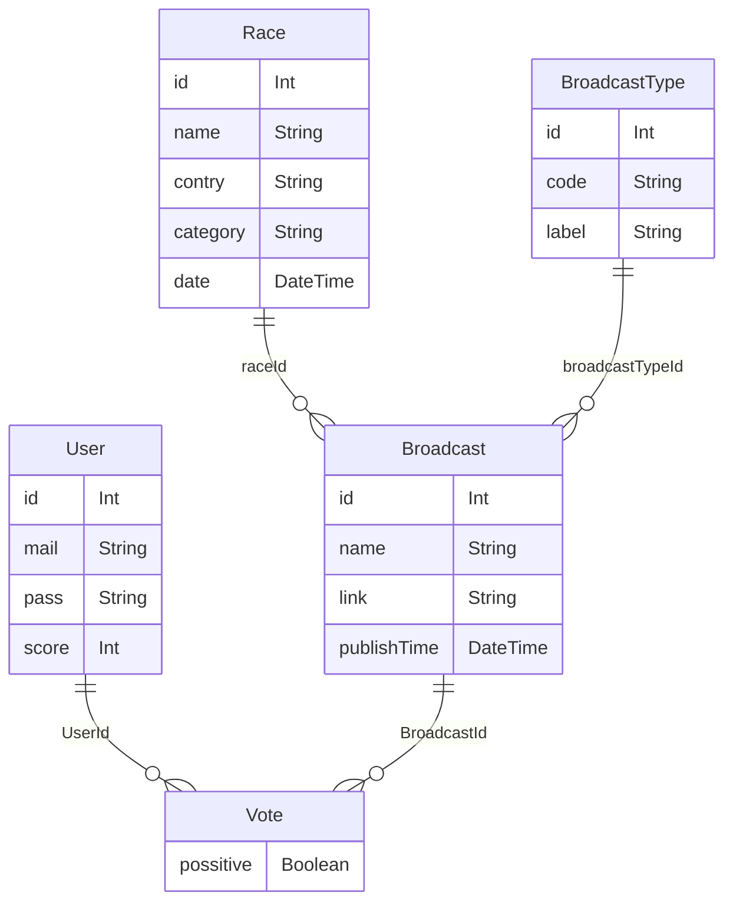

# Where to watch Next Cycling Race

Here is a small project built by the community and for the community, to help us all watch our favorite race in the best condition. This is a community feed book that indexes every broadcast of a race per country.

Please note that this project has gained higher interest since the fall of gnc+.


## Developing

Once you've created a project and installed dependencies with `npm install` (or `bun install` ), start a development server:

```bash
npm run dev

# or start the server and open the app in a new browser tab
npm run dev -- --open
```

Then start a devlopment database with prisma:

```bash
npx prisma db push
```

## Technologie Stack

- SvelteKit + Tailwind (Front)
- Primsa (ORM)
- PlanetScale (Database)

[here](https://www.scott.is/writing/about/building-a-microblog-with-svelte-planetscale-and-prisma) is a guide on how to setup a similar strcture

## Database


